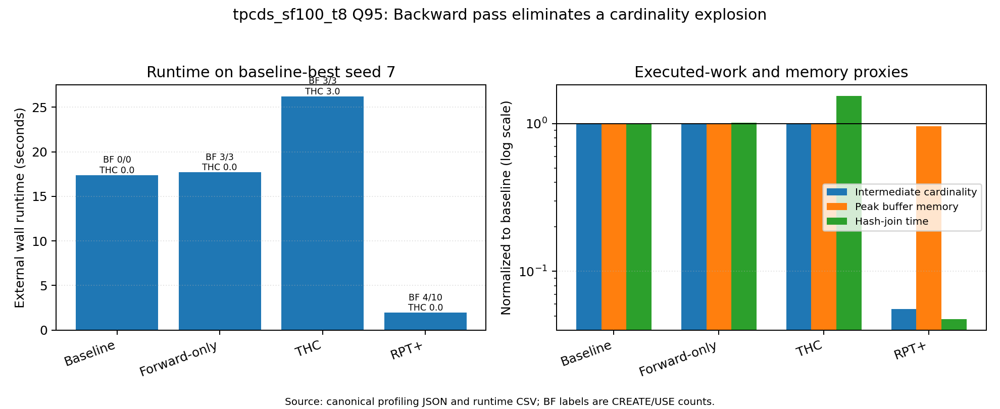
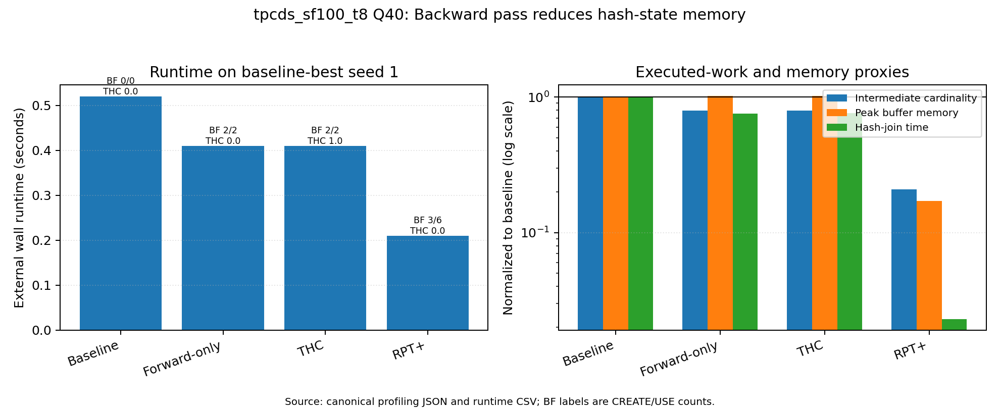
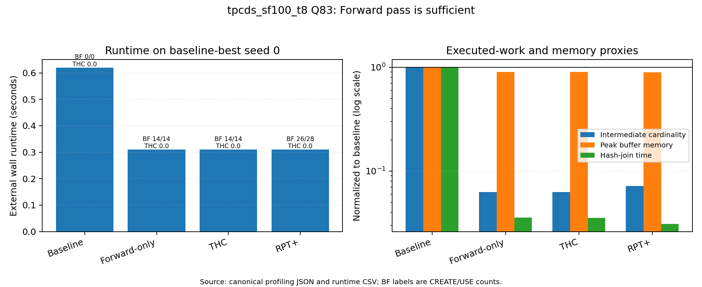
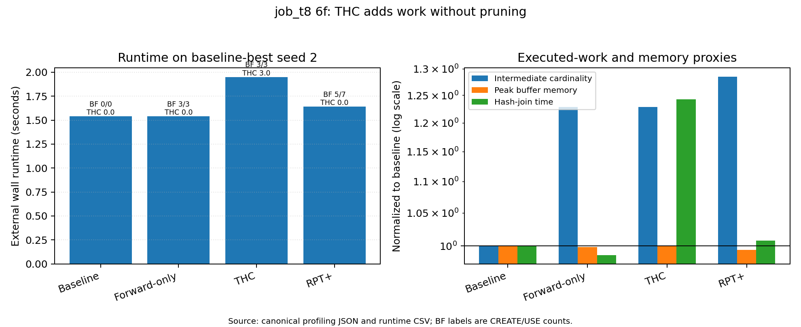
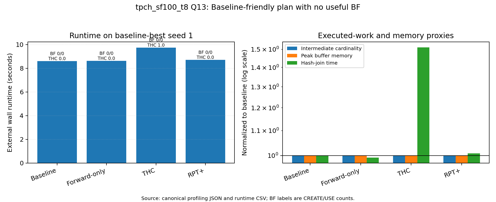
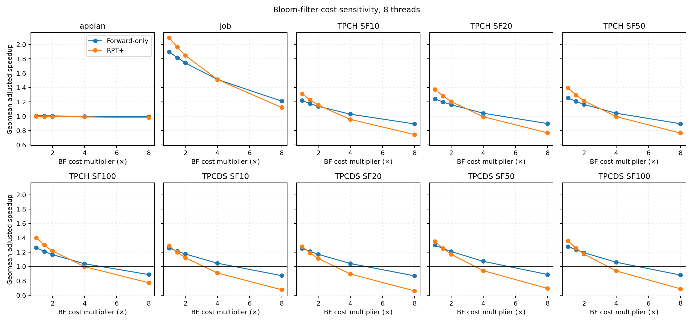
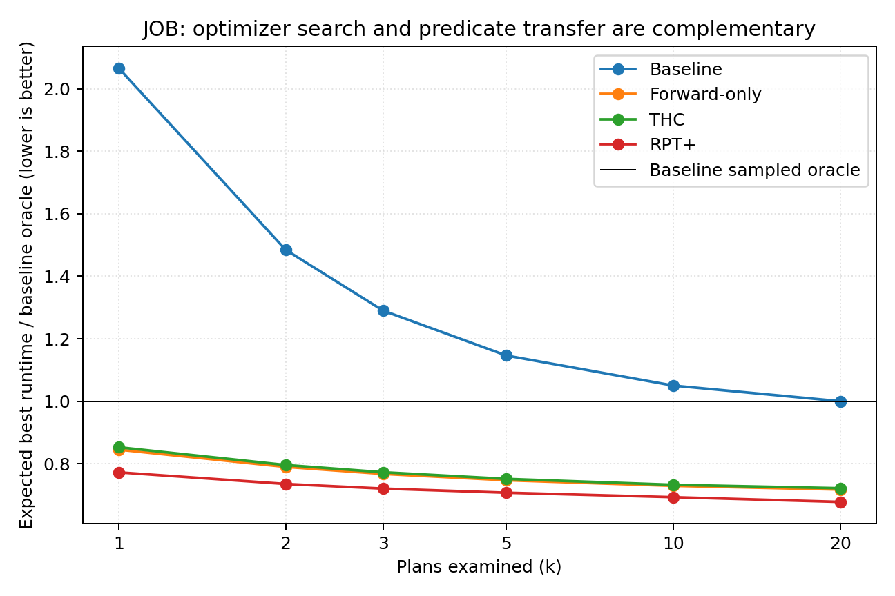

# Predicate Transfer, Hash-Join Locality, and Optimizer Robustness

## Evidence and findings for a VLDB/SIGMOD analysis paper

This document is the running research report for the RPT+/TieredHashCache
experiments. It is deliberately more detailed than a conference paper. The
intended workflow is to remove material after the claims and case studies have
been selected, not to reconstruct missing evidence during writing.

All headline numbers are reproducible with
`scripts/measure/analyze_paper_results.py`. Compact derived data and figures are
under `paper_analysis/`; raw measurements and profiles remain read-only under
`/home/hugo/code/results-spy/results/`.

## 1. Executive findings

### 1.1 The strongest current result

Predicate transfer is most valuable as protection against poor join orders, but
it still improves many of the best sampled baseline plans. This distinction is
central:

- On JOB at eight threads, forward-only PT improves the query-weighted
  geometric mean of per-query median paired speedups by **1.890×** over the
  no-PT baseline. Full RPT+ improves it by **2.092×**.
- When every query is instead anchored to the seed that is best for the
  no-PT baseline, forward-only still improves JOB by **1.258×** and full RPT+
  by **1.330×**. PT therefore does more than rescue bad plans.
- The gap between 2.092× on the full seed distribution and 1.330× on the
  baseline's best sampled seed measures an important part of PT's robustness
  value. It also shows why PT is not a reason to discard query optimization:
  a good plan and PT provide complementary gains.
- JOB is where plan uncertainty is clearly visible. The median query's
  no-PT median plan is **47.6%** slower than its sampled oracle and its p90 plan
  is **95.2%** slower. Under full RPT+, the median query has zero measured
  median regret at the script's 0.01-second resolution, and 95% of its plans
  are within 10% of the per-query sampled oracle.

This result must be described as robustness over **20 deterministic sampled
left-deep plans**. It is not evidence about the accuracy of DuckDB's native
join-order optimizer because the canonical runs did not use that optimizer.

### 1.2 Forward transfer is the broadly useful component

At eight threads:

- JOB: **1.890×** forward-only versus baseline.
- TPC-H: **1.217×, 1.240×, 1.255×, and 1.262×** at SF10, SF20, SF50, and
  SF100.
- TPC-DS: **1.258×, 1.254×, 1.299×, and 1.280×** at SF10, SF20, SF50, and
  SF100, excluding Q54 because all plans time out.
- Appian: **1.005×**, effectively neutral.

Forward transfer is therefore not universally beneficial, but it is the only
new mechanism that gives a broad, repeatable improvement across JOB and both
TPC suites. The Appian exception is important: its left-outer-join workload
does not automatically imply useful forward propagation under the tested
transfer plan.

### 1.3 The backward pass is incremental on average and decisive on a minority

Full RPT+ relative to forward-only at eight threads:

- JOB: **1.070×** query-weighted geometric mean; 23 of 113 queries have a
  lower median under full RPT+.
- TPC-H: **1.088× to 1.115×** as scale grows from 10 to 100; 8 to 11 of 22
  queries have a lower median.
- TPC-DS: **1.013×, 1.025×, 1.040×, and 1.055×** from SF10 to SF100; the
  count of queries with a lower median grows from 11 to 24 of the 98
  non-Q54 queries.
- Appian: **0.991×**, effectively neutral/slightly negative.

The aggregate effect is modest because many queries tie at 0.01-second
resolution, but the growth with scale and the large individual wins support a
conditional recommendation: a forward pass is broadly attractive; the
backward pass matters when it prevents large, unproductive build/intermediate
states. The profiling case studies below test that mechanism directly.

### 1.4 THC does not replace the backward pass

The tested THC configuration is a consistent negative result:

- On JOB at eight threads, THC over forward-only is **0.994×** in the
  query-weighted geometric mean and is not the uniquely faster median on any of
  113 queries.
- On TPC-H, THC over forward-only ranges from **0.918× to 0.935×**.
- On TPC-DS, it ranges from **0.973× to 0.989×**.
- On Appian, it is **0.850×**, a 17.6% slowdown in runtime terms.
- Full RPT+ beats THC by **1.160×** on Appian, **1.079×** on JOB,
  **1.182–1.218×** on TPC-H, and **1.025–1.085×** on TPC-DS.

THC may still be a useful explanatory device in the paper: it is an explicit
attempt to compact a hot build-side working set into cache. The negative result
shows that cache-locality repair is not equivalent to eliminating cold tuples.
Backward transfer can avoid post-scan materialization, hash-table construction,
and probe work; a post-build cache can affect only part of that pipeline and
adds its own collection/probe overhead. Base rows scanned were generally
unchanged in the strongest measured case studies.

The result applies to the **specific benchmark configuration**. The paper runs
disabled the first-cycle, delta-cost, and shrinkage adaptive checks, set
`thc_mu_s_method='none'`, and never skipped collection because of a low miss
rate. It would be incorrect to claim that every possible adaptive THC design
fails.

### 1.5 The no-PT baseline is rarely the unique median winner, but ties matter

At eight threads, 592 of 605 query/configuration units have all four cases
complete enough for uncensored median comparison:

- Case 1 is the unique median winner in **22/592 (3.7%)**.
- Full RPT+ is the unique median winner in **131/592 (22.1%)**.
- Forward-only is unique in 21 and THC in only 3.
- Exact ties are pervasive, especially at 64 threads, because wall time was
  rounded to 0.01 seconds. Counting cases that participate in a tie, Case 1 is
  among the winners in 204/592 while full RPT+ is among them in 478/592.

The defensible observation is therefore not “DuckDB almost never wins.” It is:
the no-PT baseline is rarely the **unique** winner at eight threads, while full
RPT+ is most often among the winners. Very short queries and coarse timing make
winner counts less informative than paired speedup distributions.

## 2. What was actually measured

### 2.1 Treatments

All cases use the common settings and the same seed:

- **Case 1 — baseline:** `disable_rpt=true`,
  `disable_tiered_hash_cache=true`.
- **Case 2 — forward-only:** `rpt_forward_only=true`,
  `disable_tiered_hash_cache=true`.
- **Case 3 — THC:** `rpt_forward_only=true`, THC enabled.
- **Case 4 — full RPT+:** THC disabled; forward and backward transfer enabled.

The clean marginal comparisons are:

- Case 2 / Case 1: value of the forward pass.
- Case 3 / Case 2: marginal value/cost of THC.
- Case 4 / Case 2: marginal value/cost of the backward pass.
- Case 4 / Case 1: full RPT+ end-to-end result.
- Case 4 / Case 3: backward transfer versus explicit hot-set caching.

Speedup is defined as old/base runtime divided by new/treatment runtime, so a
number greater than one favors the treatment.

### 2.2 Case 1 is not stock DuckDB's optimizer

`settings-common.sql` sets:

```sql
SET use_seeded_root = false;
SET use_seeded_transfer_order = true;
SET join_order_mode = 'seeded_left_deep';
```

The transfer order is passed to the join-order enumerator even when RPT
operator insertion is disabled. Thus Case 1 uses DuckDB's hash-join execution
without PT or THC, but with this project's forced seeded left-deep order.

Recommended names in the paper:

- “no-PT baseline” or “baseline execution,” not “stock DuckDB.”
- “best sampled baseline plan,” not “DuckDB's best plan.”
- “sampled optimizer quality,” not “DuckDB optimizer quality.”

A claim about native DuckDB would require a separate
`join_order_mode='duckdb'` control, which is absent from the existing corpus.

### 2.3 Seeds represent plan uncertainty

Each corpus uses seeds 0–19. A seed deterministically controls transfer-order
growth and, through `seeded_left_deep`, join order. The root remains the
cardinality-selected root because `use_seeded_root=false`.

For a fixed query and seed, profiling join signatures show that all four cases
normally share the same hash-join skeleton. This enables paired treatment
comparisons. Across seeds, the plan changes. The 20 points in a boxplot are
therefore 20 candidate plans, not 20 timing repetitions.

Consequences:

- Boxplot spread estimates sensitivity to this finite plan sample.
- It does not estimate run-to-run variance, thermal variance, or a confidence
  interval around a fixed plan.
- Traditional independent-samples tests on these points would answer the wrong
  question.
- The report uses paired ratios, per-query medians, finite-sample regret, and
  query-weighted geometric means. It avoids p-values that imply unmeasured
  execution replication.

### 2.4 Benchmark protocol

The canonical orchestration runs Appian, JOB, four TPC-H scales, and four
TPC-DS scales with four cases and 20 seeds:

- Appian: 8 queries, 60-second timeout.
- JOB: 113 queries, 300-second timeout.
- TPC-H: 22 queries at SF10/20/50/100, 300-second timeout.
- TPC-DS: 99 queries at SF10/20/50/100, 300-second timeout.
- Thread campaigns: 1, 8, and 64.
- One execution per `(query, case, seed)`.
- JSON profiling enabled.
- Linux page cache not dropped by default.

The loop is case-major, then seed, then query. Because cases were not
interleaved/randomized and page cache was warm, slow drift or systematic cache
warming can bias treatment comparisons. Fresh DuckDB processes remove
process-local state but not OS page-cache state.

Runtime is external wall time rounded to two decimals. The root profile also
contains higher-precision latency and CPU time; those values are used for
mechanistic decomposition, while the external runtime remains the primary
benchmark result.

## 3. Corpus audit and provenance

### 3.1 Canonical coverage

After correcting the TPC-DS SF50/1-thread index entry, the corpus contains:

- **30 complete runtime grids.**
- **1,815 query/configuration units.**
- **145,200 runtime observations.**
- **1,466 timeout sentinels.**
- **0 recorded OOM/temp-limit sentinels.**
- Matching median CSVs, boxplot directories, and profiling directories for all
  30 rows.

The original SF50/1-thread row pointed both runtime and profiling columns to
the SF20 timestamp while its boxplots used SF50. The corrected source is
`tpcds_runtimes_sf50_20260715_004542.csv` with
`profiling_20260715_004542`.

### 3.2 Commit and thread provenance

- One thread: Appian/JOB/TPC-H declare commit `bde1b45f`; TPC-DS declares
  `9f07e58e`.
- Eight threads: all ten datasets declare `d043edd7`.
- Sixty-four threads: Appian/JOB/TPC-H declare `b0b9a94f`; TPC-DS declares
  `6e24bd2d`.

Read-only history shows the committed core source is stable across these
campaign points; most differences are benchmark-driver changes and the thread
setting. However, the commits are not complete experimental provenance:
`settings-common.sql` was sometimes edited without committing before a run.
The thread labels are also present only in `results_summary.csv`, not in raw
runtime rows or profile metadata.

For this reason:

- The eight-thread campaign is the primary cross-suite comparison.
- Other thread campaigns are replication/sensitivity evidence.
- Relative case effects within one timestamp are stronger evidence than
  absolute cross-campaign scaling.

### 3.3 Missing profiles

Timeouts do not produce a complete profile. In addition, JOB query 4c lacks all
80 profiles in the eight- and 64-thread runs despite successful runtime rows.
The runtime analysis includes those rows; profiling-based claims do not.

### 3.4 Failure encoding

The drivers encode:

- `9999999` as timeout (and also process exit 137).
- `8888888` as a recognized DuckDB OOM or temp-spill-limit error.

The corrected canonical corpus has 1,466 `9999999` rows and no `8888888` rows.
These sentinels are never treated as seconds. Completion rates are reported
separately; an optional capped-at-timeout analysis is explicitly a lower bound
on failed runtime.

The meeting observation that TPC-DS Q54 can OOM remains plausible and
important, especially because an exit-137 kill is classified as timeout before
error-text inspection. It is not, however, a measured canonical OOM result.

## 4. Aggregate runtime findings

### 4.1 JOB

JOB provides the cleanest optimizer-robustness signal.

At eight threads:

- Forward-only / baseline: **1.890×**; lower median on 86/113 queries.
- THC / baseline: **1.892×**; essentially the same total gain because the
  forward pass dominates.
- Full RPT+ / baseline: **2.092×**; lower median on 94/113.
- THC / forward-only: **0.994×**; no query has a uniquely lower THC median.
- Full / forward-only: **1.070×**.
- Full / THC: **1.079×**.

Interpretation:

1. Forward transfer supplies most of the average gain.
2. Backward transfer supplies a smaller aggregate increment but helps an
   important subset.
3. THC adds no measurable aggregate value over forward-only.
4. Full RPT+ reduces sensitivity to the sampled join order far more than it
   improves the already-best baseline plan.

The thread campaigns do not have identical timing resolution effects. At one
thread, where queries are longer, more strict ordering is visible and 27 JOB
queries have strict median ordering `T1 > T2 > T3 > T4`. At eight threads,
strict monotonicity is zero because Cases 2/3/4 often round to the same 0.01
seconds. This is a measurement-resolution effect, not evidence that the
one-thread mechanism disappears.

### 4.2 TPC-H

At eight threads, from SF10 to SF100:

- Forward-only / baseline: **1.217× → 1.262×**.
- Full / baseline: **1.312× → 1.400×**.
- Full / forward-only: **1.088× → 1.115×**.
- THC / forward-only: **0.921×, 0.935×, 0.918×, 0.917×**.
- Full / THC: **1.182× → 1.218×**.

The slight growth of full RPT+'s benefit with scale is consistent with
backward pruning avoiding increasingly large hash/intermediate states. It is
not enough on its own to establish the mechanism; profile cardinality and
memory evidence is required.

### 4.3 TPC-DS

Q54 times out for all cases at many scales and contributes no paired successful
speedup. Among the other 98 queries at eight threads:

- Forward-only / baseline: **1.258×, 1.254×, 1.299×, 1.280×**.
- Full / baseline: **1.287×, 1.279×, 1.349×, 1.357×**.
- Full / forward-only: **1.013×, 1.025×, 1.040×, 1.055×**.
- THC / forward-only: **0.989×, 0.985×, 0.984×, 0.973×**.
- Full / THC: **1.025×, 1.038×, 1.060×, 1.085×**.

The backward pass becomes more useful as scale increases: its query-weighted
geometric mean rises from 1.013× at SF10 to 1.055× at SF100, and the count of
queries with lower median rises from 11 to 24. THC moves in the opposite
direction, becoming slightly more costly relative to forward-only.

### 4.4 Appian

Appian is a strong negative/control result:

- Forward-only / baseline: **1.005×**.
- Full / baseline: **0.996×**.
- THC / forward-only: **0.850×**.
- Full / THC: **1.160×**.

The seeded plans have little runtime variation, so there is little bad-plan
tail for PT to repair. Forward and backward BF work is approximately neutral,
whereas THC overhead is visible on all eight queries. The paper should use
Appian to bound the claim: left joins alone do not imply that PT or hot-set
caching will help.

## 5. Optimizer value versus robustness

### 5.1 Two different questions

The seed distribution answers: “How robust is each execution strategy when the
join order may be wrong?”

The baseline-best anchor answers: “If an optimizer found the best of these 20
baseline plans, would PT still help on that plan?”

Both are necessary. Reporting only the best plan hides robustness; reporting
only the box hides optimization headroom.

### 5.2 PT on the baseline's best sampled plan

At eight threads, geometric mean speedup on Case 1's best seed:

- JOB: forward **1.258×**, THC **1.247×**, full **1.330×**.
- TPC-H SF100: forward **1.167×**, THC **1.079×**, full **1.259×**.
- TPC-DS SF100 (98 successful-query anchors): forward **1.146×**, THC
  **1.112×**, full **1.195×**.
- Appian: forward **0.967×**, THC **0.812×**, full **0.970×**.

Full RPT+ therefore remains useful after strong sampled plan selection on JOB
and the TPC suites. The gain is smaller than over the full seed distribution,
which quantifies the optimizer/PT complement:

- Better optimization removes avoidable plan work.
- Forward/backward PT still removes unproductive tuples within the selected
  plan.
- PT narrows the penalty when optimization is wrong.

### 5.3 Best-of-k curves

`paper_analysis/derived/optimizer_best_of_k.csv` computes the exact expected
minimum of `k` plans sampled without replacement from the finite 20-plan set.
These curves should be used to make a budget argument:

- At small `k`, PT's robustness can dominate additional plan search.
- As `k` grows, the no-PT baseline improves, but its asymptote is the sampled
  oracle and remains slower than full RPT+ on many queries.
- An optimizer plus PT reaches the best absolute times; PT is not a substitute
  for searching when search is cheap and reliable.

The curve is finite-sample descriptive evidence. The 20 orders were generated
deterministically and are not guaranteed to be a uniform sample of all valid
left-deep orders.

## 6. Reassessment of meeting examples

The older boxplots correctly motivated the question, but their examples do not
all replicate as unique baseline wins in the canonical July campaigns.

### 6.1 JOB 10b and 23b

At eight threads:

- JOB 10b median runtimes are 0.31 / 0.21 / 0.21 / 0.21 seconds. Cases 2–4
  tie and all beat baseline.
- JOB 23b medians are 0.36 / 0.21 / 0.21 / 0.21 seconds. Cases 2–4 again tie.
- On the best baseline seed, all four cases round to 0.21 seconds for both
  queries.

At one thread, 10b is won by full RPT+ (1.205 / 0.72 / 0.72 / 0.68), while
23b is narrowly won by THC (1.165 / 0.585 / 0.58 / 0.585). These are not
current examples of a no-PT plan beating PT.

### 6.2 TPC-H baseline-friendly queries

The baseline-friendly story is query-, scale-, and thread-dependent:

- Q4: baseline is uniquely best at eight-thread SF20, ties at SF10/SF50, and
  ties forward-only at SF100 while THC is clearly slower.
- Q13: baseline is uniquely best at eight-thread SF100 (8.61 versus 8.62,
  9.85, 8.62 seconds), but often ties another case at lower scales.
- Q16: usually ties all cases at eight threads; the runtime is too short for a
  strong treatment conclusion.
- Q11 and Q12: full RPT+ is consistently useful at moderate/high scale.
- Q8: full RPT+ is the clear eight-thread winner at all four scales. At SF100
  its medians are 10.505 / 4.36 / 4.415 / 4.00 seconds. This supports the
  forward-plus-backward story, not a baseline-win story.

The older query list should be presented as evidence that PT has overhead on
some plans, not as a stable set of DuckDB-winning queries.

## 7. Reliability findings

After correcting the SF50 index, the 1,466 timeouts are concentrated rather
than diffuse:

- TPC-DS Q54 is the dominant failure and often times out under every case and
  seed.
- TPC-H Q5 times out on a fixed subset of seeds across cases, indicating plan
  sensitivity rather than treatment-specific failure.
- Additional TPC-DS timeouts appear on Q44, Q82, Q72, Q37, and Q24,
  especially as scale grows.
- The one-thread JOB run has nine timeouts; the eight- and 64-thread JOB runs
  complete.

Failure comparisons must use completion counts. A missing ratio because one
side timed out can itself be a treatment win/loss, but it cannot be converted
to a 9,999,999-second speedup.

## 8. Claim ledger

### Directly observed

- The corrected corpus has 145,200 runtime rows, 1,466 timeout rows, and no OOM
  sentinel.
- Forward-only and full RPT+ improve aggregate JOB/TPC results at eight
  threads; Appian is neutral.
- THC is slower than forward-only in aggregate in every eight-thread suite.
- Full RPT+ is more robust over JOB's sampled join orders.

### Deterministically derived

- Query-weighted geometric means, median winners, sampled-plan regret,
  baseline-best anchors, and exact finite-set best-of-k curves.
- Same-seed comparisons are paired by construction.

### Mechanism-supported interpretations

- Forward transfer removes enough downstream work to dominate its BF overhead
  on JOB/TPC.
- Backward transfer helps when it prevents large unproductive hash/intermediate
  states.
- THC's locality-only intervention cannot recover scan/build/materialization
  savings available to backward pruning.

These interpretations require the profiling evidence in later sections.

### Unsupported or too strong

- “Case 1 is stock DuckDB.”
- “The seeds are repeated timing trials.”
- “THC never works.”
- “TPC-DS Q54 OOMs in the canonical data.”
- “The backward pass should always be enabled.”
- “The results predict distributed performance.”
- “The best of 20 seeds is the globally optimal join plan.”

## 9. Parallelism changes the conclusion

The treatment effect is largest at one thread, smaller at eight threads, and
usually disappears at 64 threads. This is one of the most important findings
from analyzing all 30 result sets rather than only the eight-thread campaign.

### 9.1 JOB across threads

Query-weighted geometric mean of per-query median speedups:

- One thread: forward **2.453×**, full RPT+ **2.766×**, backward over
  forward-only **1.093×**, THC over forward-only **0.995×**.
- Eight threads: forward **1.890×**, full **2.092×**, backward **1.070×**,
  THC **0.994×**.
- Sixty-four threads: forward **1.562×**, full **1.588×**, backward
  **1.005×**, THC **0.994×**.

Forward filtering remains valuable on JOB even at 64 threads, but most of the
incremental backward-pass benefit is gone. A likely explanation is that
parallel scan/build/probe work hides or amortizes work that is dominant in the
serial execution, while BF pipeline synchronization/creation does not shrink
proportionally. That explanation is a hypothesis until the profile CPU/wall
decomposition is considered.

### 9.2 TPC-H across threads

At one thread, the result is stable across scale:

- Forward is **1.235–1.238×**.
- Full RPT+ is **1.414–1.425×**.
- Backward over forward-only is **1.135–1.143×**.

At eight threads:

- Forward grows from **1.217×** to **1.262×**.
- Full grows from **1.312×** to **1.400×**.
- Backward grows from **1.088×** to **1.115×**.

At 64 threads:

- Forward is only **1.009–1.016×**.
- Full is **0.997–1.015×**.
- Backward is **0.984–0.999×**, slightly slower than forward-only.

The 64-thread result prevents a universal “always run the backward pass”
recommendation. At high parallelism, the tested backward pass does not provide
an aggregate TPC-H gain.

### 9.3 TPC-DS across threads

At one thread:

- Forward is **1.342–1.407×**.
- Full is **1.483–1.554×**.
- Backward over forward-only is **1.086–1.113×**.

At eight threads:

- Forward is **1.254–1.299×**.
- Full is **1.279–1.357×**.
- Backward is **1.013–1.055×**, improving with scale.

At 64 threads:

- Forward is **1.027–1.053×**.
- Full ranges from **0.904×** at SF20 to **1.027×** at SF100.
- Backward is **0.936–0.972×** and is an aggregate regression at every scale.

TPC-DS SF20/64-thread full RPT+ is the strongest aggregate counterexample:
full RPT+ is about 10.6% slower than the baseline and 6.8% slower than
forward-only in speedup terms. This result should be investigated in profiles
and retained in the paper even if the final narrative emphasizes the serial
and eight-thread wins.

### 9.4 Appian across threads

Appian remains neutral for PT and negative for THC:

- Forward: **1.000×, 1.005×, 0.997×** at 1/8/64 threads.
- Full: **1.005×, 0.996×, 0.995×**.
- THC over forward: **0.926×, 0.850×, 0.849×**.

THC's cost becomes more visible once more threads contend for or populate the
cache structure. Full RPT+ avoids that regression but does not improve Appian.

### 9.5 What parallelism does and does not prove

The attenuation is consistent across suites, but absolute scaling is not a
clean controlled experiment:

- Campaigns ran on different dates and declared commits.
- The exact uncommitted settings snapshot is unavailable.
- Very short 64-thread runtimes are heavily quantized at 0.01 seconds.
- The 64-thread machine topology, NUMA placement, and effective pinned cores are
  not recorded with each CSV.

The strong claim is descriptive: in these measurements, treatment speedups
shrink as configured thread count rises. The mechanism and generality require
more controlled evidence than this existing-only analysis can provide.

## 10. Scale sensitivity

Scale affects the backward pass more consistently than the forward pass:

- TPC-H/eight-thread forward moves only 1.217×→1.262× from SF10→SF100,
  while full RPT+ moves 1.312×→1.400×.
- TPC-DS/eight-thread forward is roughly flat (1.258×→1.280×), while
  backward over forward grows 1.013×→1.055× and full over THC grows
  1.025×→1.085×.
- TPC-DS timeout count also grows with scale, especially at one thread:
  84, 93, 108, and 207 timeout rows from SF10→SF100.

This supports a size-sensitive policy: backward pruning is most promising when
build/intermediate states are large enough for avoided work to dominate BF
creation. It does not support a scale-only decision rule because some large
queries still see no benefit and high parallelism changes the tradeoff.

## 11. Failure concentration and treatment effects

Corrected timeout totals by case are:

- Case 1: **455**.
- Case 2: **337**.
- Case 3: **338**.
- Case 4: **336**.

Thus PT-enabled cases complete roughly 118–119 observations that the baseline
does not. This is a robustness result separate from speedup on completed
queries.

Timeout concentration:

- TPC-DS Q54: **960** rows.
- TPC-H Q5: **276**.
- TPC-DS Q44: **80**.
- TPC-DS Q82: **40**.
- TPC-DS Q72: **37**.
- TPC-DS Q24: **34**.
- TPC-DS Q37: **30**.
- JOB: nine total, across 16b and the 17-query family in the one-thread run.

Q54's 960 rows equal 12 complete dataset campaigns × four cases × 20 seeds:
the query times out everywhere in the canonical TPC-DS grid. It cannot rank the
four strategies, but it is evidence that none of them is sufficient for every
query.

## 12. Profiling evidence and mechanism

The analyzer successfully parsed **143,494 JSON profiles**. This is exactly the
145,200 runtime rows minus 1,466 timeouts and 240 successful JOB 4c rows whose
profiles are absent. There are no parse failures.

### 12.1 Same-seed plan equivalence

For **35,782** `(dataset, query, seed)` groups with all four profiles present,
the normalized depth-first hash-join signature is identical across all four
cases. There are **zero mismatches** after ignoring CREATE_BF/USE_BF wrappers.

This is a major validity result. The paired runtime differences are not caused
by silently selecting different join trees for different cases. They measure
the execution effects of forward BF, THC, and backward BF on the same join
skeleton.

The signature check uses operator order, join type and conditions, table, CTE,
and delimiter identifiers. It cannot prove that every pipeline scheduling
decision is identical, and PT intentionally changes cardinalities reaching
those joins.

### 12.2 What profile timing means

The useful fields are:

- Root `latency` and `cpu_time`.
- Exclusive per-operator `operator_timing`.
- CREATE_BF, USE_BF, HASH_JOIN, and scan counts/timing.
- `cumulative_cardinality` and `cumulative_rows_scanned` as work proxies.
- Root peak buffer memory and temp-directory size.
- Per-hash-join THC lifecycle counters.

`enable_hash_join_timers=false` in the paper settings. Consequently the custom
Build/Probe/Match and THC Collect/Insert/Probe timer strings are zero and are
not used. The analysis cannot retrospectively divide each hash join into build
and probe time or identify the reason a Bloom-filter creation was dropped.

### 12.3 Bloom-filter CPU share

At eight threads, medians over successful profiles:

- JOB forward-only: 7 CREATE and 7 USE operators; **7.9%** median BF CPU
  share. Full RPT+: 10 CREATE and 14 USE; **12.1%**.
- TPC-DS SF100 forward-only: 2 CREATE and 2 USE; **4.7%**. Full: 4 CREATE and
  6 USE; **15.0%**.
- TPC-H SF100: the median forward-only query has no scheduled BF, but the mean
  BF CPU share is 8.2% because a subset pays substantial cost. Full RPT+ has
  median 1 CREATE/1 USE and **12.6%** BF CPU share.
- Appian BF CPU share is below 0.3% in the median profile; its PT neutrality is
  not caused by a large BF operator cost. Many Appian plans simply find little
  useful transfer work.

Full RPT+ wins despite spending more CPU on BFs when those BFs remove enough
hash-join work. The decision is therefore not “are BFs cheap?” but “does
avoided downstream work exceed their cost?”

### 12.4 Runtime reduction tracks CPU/hash work, not base-table scans

Across 600 eight-thread query groups, using profile latency for full RPT+
versus forward-only, log speedup has the following Pearson/Spearman
correlations (HASH_JOIN uses the 584 groups with positive timing in both
cases):

- Total CPU-time reduction: **0.901 / 0.850**.
- HASH_JOIN timing reduction: **0.498 / 0.634**.
- BF-normalized cumulative-cardinality reduction: **0.673 / 0.361**.
- Peak-buffer-memory reduction: **0.302 / 0.355**.
- Rows-scanned reduction: only **0.115 / 0.183**.

The strong Q95 and Q40 wins leave base rows scanned unchanged. Their gains come
from fewer tuples being materialized/hashed after scanning and from smaller
hash/intermediate work, not scan avoidance.

These are associations, not independent causal samples: each point is a
deterministic plan and related plans share a query. Root cumulative cardinality
also counts the extra CREATE_BF/USE_BF wrappers, so it must be normalized before
comparison. Aggregate ratios remain misleading because most plans are
unaffected while a minority have enormous reductions. The paper should show
query-level scatterplots and concrete operator trees rather than claim that
every RPT+ run has lower cardinality or memory.

### 12.5 Why THC loses

THC's strongest empirical pattern is conditional on activation:

- **Appian:** THC instantiates in all 160 eight-thread case-3 profiles. THC
  versus forward-only is **0.840×** across those plan/profile pairs. In the 60
  profiles with a frozen THC, it is **0.746×**.
- **JOB:** THC never instantiates in 1,244/2,240 profiles; those are neutral
  (**1.002×**). It instantiates in 996 and yields **0.978×**. The 26 profiles
  with a frozen THC yield **0.763×**.
- **TPC-H SF100:** never-instantiated profiles are neutral (**0.999×**);
  305 instantiated profiles yield **0.881×**, and 222 frozen profiles yield
  **0.826×**.
- **TPC-DS SF100:** 1,388 never-instantiated profiles are neutral
  (**1.001×**); 569 instantiated profiles yield **0.910×**, and 253 frozen
  profiles yield **0.849×**.

Across eight-thread Case-3 hash joins, final states are 71,012
`never_instantiated`, 5,228 `active`, 1,904 `frozen`, and only **one**
`abandoned` (TPC-H SF50 Q4 seed 10, reason `High-Miss-Rate`). Every freeze
reason is `THC-Full`. This scarcity of abandonment is consistent with the
benchmark settings: first-cycle, delta, and shrinkage checks are disabled. The
tested THC tends to keep collecting or freeze when full even when doing so is
harmful.

This is stronger than merely observing that Case 3 is slower. It connects the
regression to the mechanism:

1. When THC does not instantiate, Case 3 approximately equals forward-only.
2. When it instantiates, runtime becomes worse.
3. Frozen THCs are the worst group, not a group that recovers backward-pass
   locality.
4. THC does not reduce logical cardinality, scan work, or build-side tuple
   creation; it adds another lookup/collection path.

The paper can present THC as a falsified design hypothesis for this
configuration. It should not generalize to an untested adaptive policy.

## 13. Five case studies

The cases were selected after the corpus-wide classification. They cover a
backward-essential cardinality case, a backward-essential memory case, a
forward-sufficient case, a THC regression, and a baseline-friendly case.
Every case uses the seed that is best for the no-PT baseline and has an
identical normalized join signature across cases.

### 13.1 TPC-DS Q95, SF100, eight threads: backward transfer is essential

Best baseline seed: 7.

- Runtime: **17.40 / 17.71 / 26.23 / 1.95 seconds**.
- Full RPT+ is **8.92×** faster than baseline and **9.08×** faster than
  forward-only.
- Forward-only schedules 3 CREATE and 3 USE operators but leaves cumulative
  cardinality at **5.435 billion**, essentially baseline.
- Full RPT+ uses 4 CREATE and 10 USE operators and reduces cumulative
  cardinality to **303.0 million**, a **17.9×** reduction.
- Hash-join exclusive time falls from **129.55 CPU-seconds** in forward-only
  to **6.11**, a **21.2×** reduction, while BF operators cost 1.73 CPU-seconds.
- THC instantiates three caches and freezes all three. Hash-join time rises to
  **197.47 CPU-seconds**, producing a 48% wall-time regression versus
  forward-only.
- Peak buffer memory changes only from roughly 5.07 GB to 4.87 GB. Q95's win is
  primarily avoided intermediate/hash work, not peak-memory relief.



Paper takeaway: explicit cache compaction cannot repair a cardinality
explosion. The backward pass changes which tuples reach the hash joins.

### 13.2 TPC-DS Q40, SF100, eight threads: backward transfer removes state

Best baseline seed: 1.

- Runtime: **0.52 / 0.41 / 0.41 / 0.21 seconds**.
- Forward transfer gives 1.27×; full RPT+ gives **2.48×** over baseline and
  **1.95×** over forward-only.
- Forward-only cumulative cardinality is 18.67 million; full reduces it to
  **4.87 million (3.83×)**.
- Peak buffer memory drops from **891.9 MB** under forward-only to
  **149.8 MB (5.95×)**.
- Hash-join time drops from **1.485** to **0.045 CPU-seconds (32.7×)**.
- THC instantiates once but neither improves runtime nor reduces memory.



Paper takeaway: this is the clean “smaller hash state” example. The backward
pass can save much more than cache misses; it avoids allocating and processing
the state.

### 13.3 TPC-DS Q83, SF100, eight threads: stop after the forward pass

Best baseline seed: 0.

- Runtime: **0.62 / 0.31 / 0.31 / 0.31 seconds**.
- Forward-only halves runtime.
- It reduces cumulative cardinality from **149.34 million** to **9.34
  million (16.0×)** and hash-join time from **2.80** to **0.10 CPU-seconds**.
- Full RPT+ schedules 26 CREATE and 28 USE operators versus 14/14 for
  forward-only, increasing BF CPU time from 0.103 to 0.129 seconds with no
  improvement at 0.01-second external-wall resolution.
- Higher-resolution profile latency across all 20 seeds is
  **0.1495→0.1646 seconds**; full RPT+ loses all 20 paired seeds. The modest
  hash-join improvement cannot repay the extra BF/operator work.
- THC never instantiates. Case 3's equality with Case 2 is not a THC success;
  it is a no-op.



Paper takeaway: the system needs a stopping policy. Once forward transfer has
removed the dominant work, backward transfer can be redundant.

### 13.4 JOB 6f, eight threads: THC makes a good-enough plan worse

Best baseline seed: 2.

- Runtime: **1.54 / 1.54 / 1.95 / 1.64 seconds**.
- Forward-only is neutral; full RPT+ is 6.5% slower; THC is **26.6% slower**
  than forward-only.
- BF timing in Case 3 is only 0.013 CPU-seconds, so BF overhead is not the
  regression.
- THC instantiates three caches and freezes one. Hash-join time rises from
  **9.93** to **12.50 CPU-seconds**, matching the wall-time increase.
- Peak memory stays at about 952 MB and no pruning benefit appears.



Paper takeaway: detecting a large hash table is insufficient. An explicit hot
cache must estimate reuse and abandon when its extra lookup/collection path is
not repaid.

### 13.5 TPC-H Q13, SF100, eight threads: baseline-friendly and no useful BF

Best baseline seed: 1.

- Runtime: **8.61 / 8.62 / 9.75 / 8.71 seconds**.
- Cases 1, 2, and 4 have identical cumulative cardinality (1.001 billion) and
  schedule **zero** CREATE/USE BF operators.
- Their hash-join CPU times are 18.33, 18.19, and 18.48 seconds. The baseline's
  0.01-second median/anchor advantage is not a substantive algorithm win.
- THC instantiates and freezes one cache, raising hash-join time to
  **27.71 CPU-seconds** and wall time by 13.1%.



Paper takeaway: this is a precise form of the “baseline wins” observation. PT
has no useful edge to instantiate and is roughly neutral; THC forces an
unproductive mechanism and loses.

### 13.6 Additional compact example: JOB 16c

JOB 16c on the best baseline seed has runtime **1.64 / 0.41 / 0.41 / 0.31
seconds**. Forward transfer gives 4×, and the backward pass adds another 1.32×.
Peak memory moves from 888 MB to 659 MB to 458 MB. This is a useful small-query
example if space prevents using both TPC-DS Q95 and Q40.

## 14. Bloom-filter cost sensitivity for a distributed setting

The existing profiles do not simulate a distributed DBMS. They do support the
narrow counterfactual requested in the project notes: multiply CREATE_BF and
USE_BF cost and ask whether the measured win survives.

### 14.1 Model

For each successful profile:

```text
f_BF = (exclusive CREATE_BF time + exclusive USE_BF time) / root CPU time
adjusted wall time(m) = measured wall time × [1 + (m - 1) × f_BF]
```

This CPU-share model assumes BF CPU scales while the conversion from CPU to
wall time remains proportional. For one-thread profiles, a second model adds
`(m-1) × BF operator time` directly to wall time. The two models are reported
separately in the derived data.

### 14.2 The requested 2× result

At eight threads, doubling CREATE/USE BF cost leaves the query-weighted
geometric mean speedup versus baseline at:

- JOB: forward-only **1.742×**, full RPT+ **1.846×**.
- TPC-H SF10/SF20/SF50/SF100:
  - Forward: **1.138× / 1.159× / 1.164× / 1.167×**.
  - Full: **1.153× / 1.204× / 1.213× / 1.218×**.
- TPC-DS SF10/SF20/SF50/SF100:
  - Forward: **1.175× / 1.171× / 1.210× / 1.193×**.
  - Full: **1.124× / 1.113× / 1.172× / 1.174×**.
- Appian: forward **1.003×**, full **0.994×**.

Thus the main JOB/TPC conclusion survives a 2× BF penalty. Full RPT+ loses more
of its advantage than forward-only because it executes more BF operators. On
TPC-DS, doubled BF cost makes forward-only better than full on aggregate even
though both remain better than baseline.

This does **not** mean the incremental backward pass survives 2×. Comparing
adjusted full RPT+ directly with forward-only over all 11,973 eight-thread
profile pairs, the geometric-mean speedup falls to **0.949×** and only
3,212 pairs favor full. Among originally backward-winning pairs, the median
break-even BF multiplier is **1.80×** (P25 1.23×, P75 3.56×). Large Q95/Q40
wins remain robust, while many small backward-pass wins reverse.

### 14.3 Break-even region

- At a 4× BF multiplier, forward-only remains slightly beneficial on JOB
  (**1.511×**), TPC-H (**1.027–1.041×**), and TPC-DS
  (**1.043–1.073×**).
- Full RPT+ remains **1.511×** on JOB, is approximately break-even on TPC-H
  (**0.955–0.999×**), and falls below baseline on TPC-DS
  (**0.897–0.943×**).
- At 8×, both PT variants are below baseline on aggregate in TPC-H/TPC-DS;
  JOB still retains 1.209× forward and 1.121× full.



### 14.4 What this estimate omits

It excludes:

- BF serialization, network transmission, and fan-out.
- Data repartitioning and remote scan cost.
- Overlap of BF creation/transfer with other work.
- The network bytes saved by filtering rows before exchange.
- Different machine/cache topology.
- Pipeline barriers that may not scale proportionally with CPU time.

The model is an operator-cost sensitivity bound, not evidence that the system
would be faster in a distributed deployment. Because it also omits reduced
network traffic, it penalizes PT without modeling one of distributed PT's main
potential benefits.

## 15. ASH-gen: implicit versus explicit hot-set caching

### 15.1 What the benchmark is designed to isolate

ASH-gen constructs a deterministic fixed-plan `R ⋈ S` benchmark. The right
side, S, is the hash-build side. Its parameters independently control:

- Total R/S/T size.
- Fraction of S that is hot/productive.
- Number of repeated probes from R into each productive S key.
- Filter selectivity and explicitly unproductive selected rows.

The committed July 1 settings describe a particularly useful thought
experiment:

- `scale_factor=40,000`, base counts 100: approximately 4 million rows per
  table.
- All rows selected.
- `join_fraction_RS=0.10`: only about 400,000 of S's 4 million rows are
  productive for the R-S join.
- `probe_multiplicity_in_R=10`: each productive build key receives repeated
  probes.
- One thread, fixed join/build-side/statistics optimizers disabled.
- THC L3 budget 36 MB.

Under this construction, the hot 10% of S is a plausible cache-resident working
set while the full hash table is much larger.

### 15.2 Three competing mechanisms

**Implicit hardware caching.** Forward-only builds the complete S hash table.
Repeated probes naturally bring productive buckets into the hardware cache;
cold buckets stop displacing hot buckets once the working set stabilizes. This
has no software cache-lookup path, but it still scans and inserts all cold S
rows.

**Explicit THC caching.** THC observes probes and copies hot build-side entries
into a compact table intended to fit in L3. It can improve locality earlier or
more reliably than hardware replacement, but it pays collection, tagging,
duplicate-check, and extra-probe costs. It also builds the original full hash
table.

**Backward predicate transfer.** RPT+ can transfer the set of R keys back to S
before the S hash build. In the ideal 10%-hot setup, it can avoid inserting
roughly 90% of S. Even if the physical scan reads all S rows, it avoids cold-row
materialization, hash computation/insertion, hash-table memory, and future
probe-chain effects. This is why RPT+ can beat both implicit and explicit
caching even when the hot subset fits in cache.

This benchmark therefore separates two questions often conflated as “cache
locality”:

1. Can repeated probes access the hot subset cheaply?
2. Can the system avoid constructing and carrying the cold subset at all?

THC targets the first. Backward transfer targets the second.

### 15.3 Audit of existing artifacts

The directory contains **18 CSV files and 99 runtime observations**. The files
do not record:

- Generator variables.
- THC settings.
- Commit.
- Run index.
- Machine/thread metadata.
- A settings hash or settings snapshot.
- Per-run profiling JSON.

Most files contain one observation per case. Two files contain five
observations per Cases 2/3/4; three earlier files contain five observations for
Cases 3/4 only. The settings were edited interactively and could be uncommitted,
so timestamps cannot safely be mapped to a committed configuration.

The reproducible inventory is
`paper_analysis/derived/ash_existing_file_summaries.csv`. Every row is marked
`not_embedded_unverified`.

### 15.4 What the numbers show—and why it is not a paper result yet

The artifacts are internally contradictory if treated as one experiment:

- June 28 five-run Case 3/4 files give full RPT+ only **1.0–3.2%** lower
  median runtime than THC.
- June 29 `030701` gives medians **0.561 / 0.563 / 0.561 seconds** for
  forward/THC/full: essentially identical.
- June 29 `030938` gives **0.552 / 0.550 / 0.561**: THC is 0.4% faster than
  forward, while full is 1.6% slower.
- Two single-run June 29 files show the desired large RPT+ result:
  **1.023 / 1.029 / 0.649** and **1.132 / 1.095 / 0.690** seconds. Full is
  1.58–1.64× faster than forward, but each is one execution with unknown
  settings.
- All six July 1 single-run files favor THC. Across those files the descriptive
  means are **0.6858 / 0.6235 / 0.6780 seconds** for forward/THC/full; THC is
  9.1% below forward and 8.0% below full. They span a settings commit and are
  not six replications of one immutable configuration.

Pooling these files would mix unknown configurations and manufacture a false
sample size. The honest conclusion is:

> The ASH-gen design can explain why backward pruning may beat cache-only
> approaches, and isolated historical runs exhibit that outcome, but the
> surviving artifacts do not establish its frequency or magnitude.

The older `ASH-datagen/search_results_10x_multiplicity.csv` varies THC budget,
collection, read-only, miss, and activation knobs. Its 56 reported averages
range only from 0.572 to 0.606 seconds, with no corresponding forward/full
control and no recoverable run-level provenance. It suggests no dramatic THC
tuning win in that historical workload, but it is not a controlled treatment
comparison for this paper. Its recorded final point uses a 24 MiB budget,
6,000,000 collection rows, 100,000 first read-only rows, 0.005 collection
budget fraction, miss threshold 1.0, and activation threshold 1, averaging
0.586 seconds. The retained tuning script no longer matches the CSV candidate
grid, and selecting knobs on the same workload is not unbiased confirmation.

### 15.5 Defensible paper use

The existing-only paper can:

- Include ASH-gen as a benchmark-design/motivation section.
- Explain implicit cache residency versus explicit THC compaction versus
  backward elimination.
- Show the two single-run RPT+ examples only as exploratory observations, with
  settings/provenance caveats.
- State exactly what a future registered run must record.

It should not:

- Claim an aggregate ASH-gen RPT+ speedup.
- Treat the 18 timestamps as repeated trials.
- Select only the two RPT+-favorable files while ignoring the July THC wins.
- Use the committed July settings as if they were embedded in every CSV.

### 15.6 Minimum provenance required for a future ASH figure

Every output row should include generator variables, all THC knobs, commit and
dirty-tree hash, threads, run index, data-generation identifier, and profile
path. A valid campaign should hold the generated database fixed, interleave
Cases 2/3/4, repeat each fixed treatment, and include at least:

- Hot fraction sweep.
- Probe multiplicity sweep.
- Hash-table-size/L3 ratio sweep.
- Forward/full/THC controls.
- Build rows, scanned rows, hash-build/probe timing, and THC state.

No new campaign was run for this report, in accordance with the existing-data
scope.

## 16. Query-level dominance classes

To avoid labeling a 0.01-second difference as a mechanism, the analyzer applies
10% thresholds to query medians. Classes overlap:

- **Forward-sufficient:** forward is at least 10% faster than baseline and full
  is within ±5% of forward.
- **Backward-essential:** full is at least 10% faster than forward.
- **THC regression:** THC is at least 10% slower than forward.
- **Forward/full regression:** the treatment is at least 10% slower than
  baseline.
- **THC approximates full:** backward is essential, but THC is within 5% of
  full.

At eight threads among 592 uncensored query/configuration units:

- Forward-sufficient: **200 (33.8%)**.
- Backward-essential: **104 (17.6%)**.
- THC regression: **67 (11.3%)**.
- Forward regression: **4 (0.7%)**.
- Full RPT+ regression: **20 (3.4%)**.
- All three treatments regress: **2 (0.34%)**.
- THC approximates full in a backward-essential case: **2 (0.34%)**.

The last count directly tests the motivating THC hypothesis. Only two units
have a >10% backward benefit while THC comes within 5% of full RPT+. In these
measurements, explicit hot-set caching almost never reproduces the backward
pass when that pass materially matters.

Parallelism changes the class distribution:

- One thread: 205/579 forward-sufficient, 143/579 backward-essential, and only
  10/579 full regressions.
- Sixty-four threads: 83/596 forward-sufficient, only 18/596
  backward-essential, and **119/596 full regressions**.

This classification yields the most precise high-level recommendation:
forward is broadly useful and rarely harmful at 1–8 threads; backward is
decisive for a minority but becomes harmful for many highly parallel
TPC-DS configurations.

## 17. The optimizer/PT result in one figure

For JOB/eight-thread, exact expected best-of-k calculations over the finite
20-plan set are normalized to each query's baseline sampled oracle:

- Baseline: **2.066, 1.485, 1.290, 1.146, 1.050, 1.000** for
  `k=1,2,3,5,10,20`.
- Forward-only: **0.845 → 0.717**.
- THC: **0.853 → 0.722**.
- Full RPT+: **0.772 → 0.678**.



This is the core “do not remove the optimizer” result:

1. A randomly selected baseline plan is 2.066× the sampled baseline oracle.
   Plan search has substantial value.
2. Even one full-RPT+ candidate has an expected query-weighted runtime 0.772×
   the best of 20 baseline plans. Robust execution can dominate much more
   optimizer search.
3. Searching more plans still improves full RPT+ from 0.772 to 0.678.
   Robustness does not eliminate optimization headroom.

The curve does not model optimizer planning cost or learned ranking. It assumes
a uniformly selected subset without replacement from these 20 deterministic
candidates and reports an exact expectation over that finite set.

## 18. Proposed paper thesis and contributions

### 18.1 Thesis

Predicate transfer and query optimization solve different failure modes.
Forward transfer is a broadly effective, low-regret way to remove probe-side
work. Backward transfer is insurance against build-side/intermediate
explosions, with gains that grow with data scale but shrink under high
parallelism. Query optimization still matters because it selects among the
residual plans that PT cannot equalize. A cache-only repair such as THC is not
a general substitute because it improves access locality only after cold state
has already been constructed.

### 18.2 Candidate contributions

1. **A controlled decomposition of robust predicate transfer.** Separate
   forward, backward, and cache-locality effects on identical seeded left-deep
   join skeletons across 145,200 executions.
2. **An optimizer-versus-robustness methodology.** Compare median sampled-plan
   behavior, treatment performance on the baseline-best seed, sampled regret,
   and exact best-of-k curves instead of conflating optimizer and execution
   improvements.
3. **A negative result for explicit hot-set caching.** Show that THC is neutral
   when inactive and systematically slower when instantiated/frozen, and
   explain why locality repair cannot reproduce eliminated build/hash
   work.
4. **A conditional backward-pass policy result.** Quantify where backward
   transfer is essential, where forward is sufficient, how the split changes
   with scale/threads, and how added BF cost shifts the choice.
5. **An evidence-bound reliability analysis.** Treat timeout/OOM outcomes as
   censored statuses and expose where provenance/instrumentation is
   insufficient rather than turning sentinels or meeting notes into results.

### 18.3 Candidate title

**Optimization Is Not Enough, and Robustness Is Not Free: Dissecting
Forward and Backward Predicate Transfer for Hash Joins**

Alternative:

**Build Less or Cache Better? Predicate Transfer, Hot Hash State, and Join-Plan
Robustness**

### 18.4 Abstract skeleton

Join ordering reduces work by choosing a favorable plan, while predicate
transfer makes a chosen plan less sensitive to unproductive tuples. It is
unclear when a second, backward transfer pass is worth its synchronization and
filtering cost, or whether cache-locality repair can recover the same benefit.
We evaluate no transfer, forward-only transfer, forward transfer with an
explicit TieredHashCache, and full forward/backward RPT+ on 20 deterministic
left-deep orders per query across JOB, TPC-H, TPC-DS, and Appian. On a common
eight-thread campaign, forward-only improves query-weighted median performance
by 1.89× on JOB and 1.22–1.30× on TPC workloads; full RPT+ reaches 2.09× and
1.28–1.40×. On JOB's best sampled baseline plans, full RPT+ still gives 1.33×,
showing that optimization and transfer are complementary. Backward transfer is
at least 10% beneficial for 17.6% of uncensored query/configurations at eight
threads, but becomes an aggregate regression under 64-thread TPC execution.
THC almost never reproduces a material backward-pass win and is slower whenever
its explicit cache activates in the principal case studies. Profiles tie RPT+
wins to eliminated intermediate/hash work; a doubled BF-cost sensitivity still
preserves aggregate JOB/TPC gains. These results support an always-consider
forward, conditionally-enable backward design while retaining join-order
optimization.

The abstract must say “sampled left-deep orders,” not “random DuckDB plans,” and
should omit ASH-gen performance until that benchmark is rerun with provenance.

## 19. Recommended paper organization

1. **Introduction.** Bad join orders versus unproductive build/probe tuples;
   thesis that optimizer and PT are complements.
2. **Background.** Forward/backward RPT+, transfer graph, hash-join costs,
   implicit cache residency, and THC.
3. **Experimental contract.** Four cases, seeded left-deep plans, pairing,
   workload/thread/scale matrix, censoring, and limitations.
4. **Aggregate result.** Eight-thread speedups and query-level classes.
5. **Optimization versus robustness.** Baseline-best anchors, regret, and
   best-of-k JOB result.
6. **Why the backward pass helps.** Scale trends, profile correlations, Q95
   and Q40.
7. **When forward is enough.** Q83 and conditional stopping.
8. **Why THC does not substitute.** State-conditional regressions, 6f/Q13,
   implicit versus explicit cache discussion.
9. **Parallelism and BF cost.** Thread attenuation and 2×/4× sensitivity.
10. **Reliability and negative results.** Timeouts, Appian, PT regressions.
11. **ASH-gen benchmark design.** Use as mechanism/motivation; disclose
    provenance gap.
12. **Discussion.** Policy implications, distributed limitations, future
    adaptive design.
13. **Threats, related work, conclusion.**

## 20. Figure plan and candidate captions

### Main-paper priority

**Figure 1 — Treatment speedup at eight threads.**
`paper_analysis/figures/geomean_speedup_8threads.png`

Caption: Query-weighted geometric mean of same-seed median speedups versus the
no-PT seeded-left-deep baseline. Forward transfer supplies most of the gain;
full RPT+ adds value on JOB/TPC while THC reduces it. Timeouts are excluded from
ratios and reported separately.

**Figure 2 — Parallelism attenuation.**
`paper_analysis/figures/speedup_by_threads.png`

Caption: Forward and full RPT+ speedup versus configured threads; TPC panels
geometrically average four scales. Treatment gains fall with parallelism and
the backward pass regresses at 64 threads. Cross-thread absolute comparisons
are exploratory because campaigns used different dates/declared commits.

**Figure 3 — Optimizer search versus robustness.**
`paper_analysis/figures/job_expected_best_of_k.png`

Caption: Exact expected best runtime after examining `k` of 20 JOB plans,
normalized per query to the baseline's 20-plan oracle. PT beats additional
baseline search, while additional search still improves PT.

**Figure 4 — Backward-essential case.**
Use Q95 as the main case and Q40 as an inset/secondary:
`case_study_tpcds_sf100_t8_q95.png`,
`case_study_tpcds_sf100_t8_q40.png`.

Caption: On the baseline's best sampled plan, backward RPT+ eliminates a
cardinality explosion (Q95) or large hash state (Q40). THC preserves the full
state and can increase hash-join CPU time.

**Figure 5 — THC activation outcome.**
Generate from `profile_pair_metrics.csv`: runtime ratio distributions for
never-instantiated, instantiated-active, and frozen THC states by suite. This
figure should replace a broad “THC loses” bar because it identifies the
mechanism.

**Figure 6 — Bloom-filter cost sensitivity.**
`paper_analysis/figures/bf_cost_sensitivity_8threads.png`

Caption: CPU-share counterfactual when CREATE/USE BF cost is multiplied.
Aggregate gains survive 2×; forward-only becomes preferable to full at lower
multipliers on TPC-DS.

### Appendix

- `median_winner_counts_8threads.png`: include only with an explicit note about
  0.01-second ties.
- `plan_tail_ratio_8threads.png`: descriptive robustness summary.
- Q83 forward-sufficient, JOB 6f THC regression, and TPC-H Q13 baseline-friendly
  case figures.
- Completion/timeout heatmap by query and case.
- Full per-suite/per-scale speedup distributions and baseline-best anchors.
- Normalized-cardinality versus runtime-speedup scatterplots with query-cluster
  styling.

## 21. Threats to validity

### Experimental design

- One execution per fixed plan: no estimate of ordinary runtime variance.
- Case-major, non-randomized order with warm OS page cache.
- External timing rounded to 0.01 seconds.
- Profiling enabled, which adds overhead and may interact with short queries.
- Twenty deterministic left-deep orders are a finite design set, not a random
  sample from all plans.
- The root is cardinality-selected rather than seed-randomized.

### Controls and provenance

- No native-DuckDB optimizer control.
- Thread campaigns use different dates and some different declared commits.
- Runtime/profile rows do not embed threads, commit, or settings.
- Declared commits cannot recover uncommitted settings edits.
- ASH-gen settings are not embedded and its files cannot be pooled.

### Measurement and mechanisms

- Timeout sentinel is also used for exit 137; OOM frequency is not identifiable.
- Failed executions usually have no profile, separating memory observations
  from failure outcomes.
- Missing JOB 4c profiles prevent mechanism analysis for that query.
- `enable_hash_join_timers=false` removes build/probe/match and THC phase
  timing.
- BF drop/disable reasons and full runtime transfer graphs are not logged.
- Root cumulative cardinality is a work proxy, not bytes or unique tuples.
- Peak buffer memory does not include every process/allocation source.
- The tested THC disables most adaptive give-up checks.

### External validity

- One machine/cache/NUMA environment.
- Only equality hash joins in these workloads.
- Parallelism result may depend on hardware topology and scheduler behavior.
- Distributed result is a cost sensitivity, not a distributed experiment.
- Appian, JOB, TPC-H, and TPC-DS do not span every skew, update, or streaming
  workload.

## 22. Final design takeaways

### For an engine designer

1. **Retain the optimizer.** PT narrows bad-plan tails but additional plan
   search still improves PT.
2. **Implement/consider the forward pass by default.** At 1–8 threads it is
   broadly beneficial and rarely a >10% regression in this corpus.
3. **Make the backward pass conditional.** It is crucial for Q95/Q40-like
   build-state explosions, increasingly useful with scale at eight threads, but
   harmful on many 64-thread TPC-DS units.
4. **Choose backward based on avoided work versus BF cost.** Candidate signals
   include estimated build cardinality after transfer, hash-state bytes,
   expected probe reuse, and parallel slack.
5. **Do not use cache locality as a proxy for pruning.** THC cannot recover
   avoided hash-build/materialization work and needs a reliable abandon path.
6. **Log decisions.** Persist settings, transfer graph, BF selectivity/drop
   reason, build/probe timing, and THC state so adaptive policies can be
   evaluated.

### For the paper narrative

The concise reader takeaway is:

> Do a forward pass unless the workload is demonstrably transfer-insensitive.
> Add a backward pass when it prevents large build/intermediate state, not as an
> unconditional second pass. Keep optimizing the join order. Cache-only repair
> is complementary at best and was not a substitute in these experiments.

### Claims to avoid in the final draft

- “DuckDB is the baseline” without the seeded-left-deep qualification.
- “RPT+ is always faster.”
- “Always execute the backward pass.”
- “THC cannot work.”
- “These boxplots measure execution variance.”
- “The optimizer chooses the best seed.”
- “Q54 demonstrates a canonical OOM.”
- “Doubling BF time predicts a distributed system.”
- “ASH-gen proves RPT+ beats implicit or explicit caching.”

## 23. Reproducibility map

Primary generated artifacts:

- `paper_analysis/derived/manifest.csv`
- `paper_analysis/derived/query_case_metrics.csv`
- `paper_analysis/derived/paired_seed_metrics.csv`
- `paper_analysis/derived/query_pair_metrics.csv`
- `paper_analysis/derived/corpus_pair_metrics.csv`
- `paper_analysis/derived/query_median_winners.csv`
- `paper_analysis/derived/baseline_best_seed.csv`
- `paper_analysis/derived/optimizer_best_of_k.csv`
- `paper_analysis/derived/profile_metrics.csv`
- `paper_analysis/derived/profile_pair_metrics.csv`
- `paper_analysis/derived/profile_correlations.csv`
- `paper_analysis/derived/plan_equivalence.csv`
- `paper_analysis/derived/distributed_query_sensitivity.csv`
- `paper_analysis/derived/distributed_corpus_sensitivity.csv`
- `paper_analysis/derived/case_study_metrics.csv`
- `paper_analysis/derived/ash_existing_file_summaries.csv`
- `paper_analysis/derived/analysis_summary.json`

Regenerate with:

```bash
python3 scripts/measure/analyze_paper_results.py --profile-workers 8
```

The analyzer validates 30 manifest rows, query counts, 20 seeds, four cases,
unique runtime keys, sentinel handling, corrected SF50 paths, successful-profile
coverage, JSON parse success, and normalized join-plan equivalence.

Final verification:

- Two complete independent regenerations produced byte-identical SHA-256
  content for all **19 derived files**.
- An independent raw-CSV calculation reproduced JOB forward 1.889500×, JOB
  full 2.092392×, TPC-H SF100 full 1.399517×, TPC-DS SF100 full 1.356830×,
  and Appian THC/forward 0.850074×.
- Raw runtime rows and all four raw profile trees were manually checked for
  Q95, Q40, Q83, JOB 6f, and TPC-H Q13. Every reported runtime matched and all
  four normalized join skeletons matched in each case.
- The independent corpus count reproduced 145,200 rows, 1,466 timeouts, and
  zero OOM sentinels.

